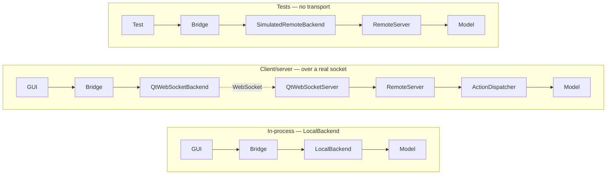

# Design specs

These files are the **authoritative design reference** for morph. They carry
the reasoning, invariants, and rejected alternatives that the code itself does
not record. Per [`AGENTS.md`](../../AGENTS.md), read a subsystem's spec before
changing that subsystem — and when a change invalidates a spec, the spec is
what gets updated, not the other way round.

This page is a **map**, not a summary. It exists so that "read the spec first"
names a specific file. For the narrative walkthrough, see
[`docs/ARCHITECTURE.md`](../ARCHITECTURE.md).

## How an action reaches a model

The client half is identical in both deployments. The two diverge at
`IBackend::execute`, and it is worth knowing which side you are looking at:
**`ActionDispatcher` is server-side only.** `LocalBackend` never consults it —
it posts the action's own `localOp` on the model's strand.

```mermaid
sequenceDiagram
    participant GUI as GUI / call site
    participant H as BridgeHandler&lt;Model&gt;
    participant B as Bridge
    participant BE as IBackend
    participant M as Model
    participant CB as cbExec

    GUI->>H: execute(action)
    H->>B: executeVia&lt;Model, Action&gt;(binding, action, cbExec)
    B->>BE: execute(ModelId, ActionCall, cbExec)

    alt LocalBackend (in-process)
        BE->>M: post call.localOp on the model's strand,<br/>under ScopedContext
    else RemoteServer (over the wire)
        BE->>BE: serialise ActionCall, send "execute"
        BE->>M: dispatchMessage looks the model up on a pool thread,<br/>then ActionDispatcher::dispatch on the model's strand,<br/>under ScopedContext
        BE->>BE: reply resolves the pending callId
    end

    M-->>CB: Completion&lt;R&gt; resolves
    CB-->>GUI: .then / .onError run on cbExec
```

Two things this diagram is making explicit, because both are easy to get
wrong:

- **`cbExec` is independent of everything above it.** Where the model ran has
  no bearing on where your `.then` runs; the callback executor you passed
  decides that. See [`core/executor.md`](core/executor.md).
- **The model's strand is what serialises access**, not a mutex in the model.
  See [`concurrency_and_lifetimes.md`](concurrency_and_lifetimes.md).

## Deployment topologies



`SimulatedRemoteBackend` exercises the *same* serialise/dispatch path as the
socket transport without a socket, which is why a bug that only appears
remotely is usually reproducible in a plain unit test. Details, including the
per-operation behaviour differences between local and remote, are in
[`core/backend.md`](core/backend.md).

## Start here — specs by the question they answer

**How a call flows**
[`core/bridge.md`](core/bridge.md) ·
[`core/backend.md`](core/backend.md) ·
[`core/registry.md`](core/registry.md) ·
[`core/completion.md`](core/completion.md) ·
[`core/wire.md`](core/wire.md)

**Threading and lifetime**
[`core/executor.md`](core/executor.md) ·
[`concurrency_and_lifetimes.md`](concurrency_and_lifetimes.md) ·
[`core/shared_instances.md`](core/shared_instances.md)

**When things go wrong**
[`error_handling.md`](error_handling.md) ·
[`core/logger.md`](core/logger.md) ·
[`core/observability.md`](core/observability.md)

**Working offline**
[`offline/offline.md`](offline/offline.md) ·
[`journal/journal.md`](journal/journal.md) ·
[`core/file_io_ops.md`](core/file_io_ops.md) — the injectable file-I/O seam
both the journal and the offline queue write through, and the one to read
before writing a durability test

**Identity**
[`session/session.md`](session/session.md) ·
[`security.md`](security.md)

**Schema-driven UI**
[`forms/forms.md`](forms/forms.md) ·
[`forms/views.md`](forms/views.md) ·
[`forms/choice.md`](forms/choice.md) ·
[`forms/widget_hints.md`](forms/widget_hints.md) ·
[`forms/workflows_navigation.md`](forms/workflows_navigation.md)

**Exact values on the wire**
[`util/rational.md`](util/rational.md) ·
[`util/quantity_type.md`](util/quantity_type.md) ·
[`util/datetime.md`](util/datetime.md) ·
[`util/tagged.md`](util/tagged.md) — the newtype wrapper that stops two
unrelated protocol scalars sharing one underlying type from being
interchangeable

**Process**
[`VERSIONING.md`](VERSIONING.md) ·
[`testing_strategy.md`](testing_strategy.md)

## Reading order

**Adding a model and its actions.** [`core/bridge.md`](core/bridge.md) for how
a handler binds and dispatches → [`core/registry.md`](core/registry.md) for
what registration macros actually do →
[`core/completion.md`](core/completion.md) for the result type you return →
[`core/wire.md`](core/wire.md) if the action must cross a socket, which
constrains the field types you may use. Then
[`ARCHITECTURE.md`'s "Adding a new model and actions"](../ARCHITECTURE.md#adding-a-new-model-and-actions)
for the concrete steps.

**Debugging a dispatch that misbehaves.** Establish which side ran the action
([`core/backend.md`](core/backend.md), whose local-vs-remote tables list the
behaviour differences that produce most of these bugs) → then
[`core/executor.md`](core/executor.md) and
[`concurrency_and_lifetimes.md`](concurrency_and_lifetimes.md) if the symptom
is a race, a use-after-free, or a callback on an unexpected thread →
[`error_handling.md`](error_handling.md) if an error arrived in the wrong shape
or not at all.

## `pinned_facts.toml`

[`pinned_facts.toml`](pinned_facts.toml) is not prose. It is the spec↔code
drift guard: each entry pins a mechanical fact some spec states in words (a
buffer size, a limit, a default) to the real symbol, and
`tests/test_pinned_facts.cpp` fails if they diverge, while
`scripts/check_spec_citations.sh` fails if the citing spec stops mentioning
it. Change a pinned value only in the same commit that changes both the code
and the prose. See [`CONTRIBUTING.md`](../../CONTRIBUTING.md) under "Quality
gates".

## Keeping this file cheap

A new spec adds one line to the map above. The diagrams change only when the
call path itself changes — if you find yourself restating what a spec says,
that belongs in the spec.
